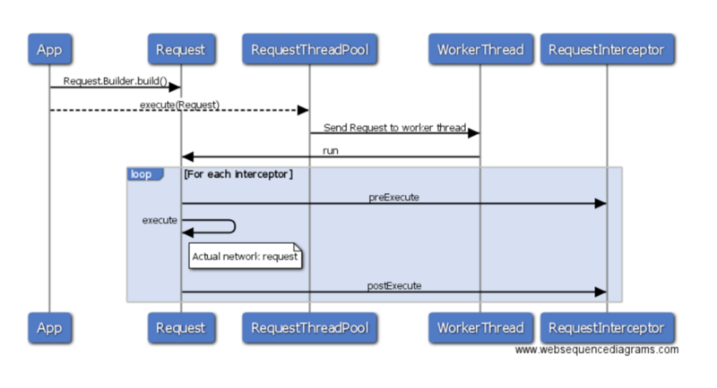

# Android HTTP ThreadPoolExecutor

High performance Android HTTP Client Library. Create a Request and assign to RequestThreadPool.
The RequestThreadPool manages worker threads to process the request. The worker thread handles
caching, network request, data parsing, retry, and finally provides callback to the caller.

## Features
- Asynchronous HTTP Request
- Handle multiple concurrent requests with ThreadPool
- Schedule request with delay
- Customizable and extensible interceptor to intercept request
- Simple and extensible caching model to cache request and response
- Automatic retry: can be configured with number of retry and retry interval
- Guarantees your response callback will never be called when the request is cancelled or the ThreadPool is purged
- A small library with high performance and simple architecture. The aar is only ~40K
- Build in response parsing to JSONObject, JSONArray, Bitmap, String, byte[]. Can be extended to support any data type.
- Flexible callback: callback can be on current or UI thread.
- Handle request in sequence or concurrent multiple requests
- Design for API request, not design for large download and upload

## Usage

### Installation

Edit your build.gradle file and add below dependency:
```gradle
    dependencies {
        compile 'com.ideal.android:http-threadpoolexecutor:0.5'
    }
```

### Use new RequestThreadPool

```java
    RequestThreadPool requestThreadPool = new RequestThreadPool.Builder().build();

    Uri uri = (new Uri.Builder()).scheme("http").encodedAuthority("localhost:" + port).appendPath("test").build();
    Request request = new Request.Builder<JSONObject>(uri)
        .onSuccess(new Request.SuccessCallback<JSONObject>() {
            @Override
            public void onSuccess(JSONObject body, HttpResponse httpResponse) {

            }
        }).onError(new Request.ErrorCallback() {
            @Override
            public void onError(Throwable t, HttpResponse httpResponse) {

            }
        }).build();

    requestThreadPool.execute(request);
```

### Enable Caching

Cache 100 request/response with LRU Memory Cache and enable request caching
```java
    RequestThreadPool requestThreadPool = new RequestThreadPool.Builder().setCache(new LRUCache(100)).build();

    //Enable cache for the request.
    Request request = new Request.Builder<JSONObject>(uri)
               .cacheable()
               .build();
```

Cache 10MB with FileCache
```java
    Cache cache = FileCache(context, 10 * 1024 * 1024);
    RequestThreadPool requestThreadPool = new RequestThreadPool.Builder().setCache(cache).build();
```
    

### Request retry

Retry 3 times with interval 1 Second
```java
    Request request = new Request.Builder<JSONObject>(uri)
               .retry(3)
               .retryInterval(1000)
               .build();
```

### Schedule a request

Schedule a request to run after 5 seconds
```java
    Uri uri = (new Uri.Builder()).scheme("http").authority("www.google.com").build();
    Request request = new Request.Builder<JSONObject>(uri).build();
    requestThreadPool.schedule(request, 5, TimeUnit.SECONDS);
```

### Cancel Request or Purge the RequestThreadPool

In your activity onStop() method, cancel single request
```java
    request.cancel()
```

or cancel all pending request
```java
    requestThreadPool.purge()
```

The callback will not be invoked after cancel.


### Send a post request

Post a JSONObject
```java
    JSONObject postData = new JSONObject("{\"name\":\"value\"}");
    Request request = new Request.Builder<JSONObject>(uri)
                .post(postData).build();
```

Post a URL Encoded form
```java
    LinkedHashMap<String, String> form = new LinkedHashMap<>();
    form.put("key1", "value1");
    form.put("key2", "value2");
    Request request = new Request.Builder<JSONObject>(uri)
            .post(form).build();
```

### Response parsing
Use response content-type to determine which DataMarshaller to transform the data.
Not necessary to define response object type for standard content-type.

Response as JSONObject
```java
    Request request = new Request.Builder<JSONObject>(uri)
        .onSuccess(new Request.SuccessCallback<JSONObject>() {
            @Override
            public void onSuccess(JSONObject body, HttpResponse httpResponse) {

            }
        }).build();
    requestThreadPool.execute(request);
```

Response as JSONArray
```java
    Request request = new Request.Builder<JSONArray>(uri)
        .onSuccess(new Request.SuccessCallback<JSONArray>() {
            @Override
            public void onSuccess(JSONArray body, HttpResponse httpResponse) {

            }
        }).build();
    requestThreadPool.execute(request);
```

Response as Bitmap
```java
    Request request = new Request.Builder<Bitmap>(uri)
        .onSuccess(new Request.SuccessCallback<Bitmap>() {
            @Override
            public void onSuccess(Bitmap body, HttpResponse httpResponse) {

            }
        }).build();
    requestThreadPool.execute(request);
```


Custom Response
```java
    Request request = new Request.Builder<Person>(uri)
                .onSuccess(new Request.SuccessCallback<Person>() {
                    @Override
                    public void onSuccess(Person body, HttpResponse httpResponse) {

                    }
                })
                .setResponseMarshaller(new PersonDataMarshaller())
                .build();
    requestThreadPool.execute(request);

    class PersonDataMarshaller implements DataMarshaller<Person> {

        @Override
        public Person unmarshal(byte[] content) throws Exception {
            //Transform the content to Person object
            return new Person();
        }

        @Override
        public byte[] marshal(Person data) throws Exception {
            return new byte[0];
        }

        @Override
        public Class<Person> getType() {
            return Person.class;
        }

        @Override
        public String requestContentType() {
            return null;
        }

        @Override
        public String[] responseContentType() {
            return new String[0];
        }
    }

    class Person {
        private String firstName;
        private String lastName;
        private int age;
    }
```
### Singleton Pattern

Singleton class that wrap the RequestThreadPool
```java
    public class Singleton {

        private static RequestThreadPool instance = new RequestThreadPool.Builder().build();
    
        private Singleton() {
        }

        public static RequestThreadPool getInstance() {
            return instance;
        }

        public void purge() {
            instance.purge();
        }

        public void execute(Request request) {
            instance.execute(request);
        }

        public void schedule(Request request, long delay, TimeUnit timeUnit) {
            instance.schedule(request, delay, timeUnit);
        }
    }
```

Sending request with Singleton class
```java
    Request request = new Request.Builder<JSONObject>(uri).build();
    Singleton.getInstance().execute(request);
```


### Architecture Design

<!--
App -> Request : Request.Builder.build()
App -> RequestThreadPool : execute(Request)
RequestThreadPool -> WorkerThread: Send Request to worker thread
WorkerThread -> Request: run
loop For each interceptor
Request -> RequestInterceptor: preExecute
Request -> Request: execute
note right of Request: Actual network request
Request -> RequestInterceptor:postExecute
end
-->

#### RequestThreadPool


<!--
Request -> CacheRequestInterceptor : preExecute
alt Cache Hit
    CacheRequestInterceptor->Request: onSuccess
end

Request -> ResponseInterceptor: preExecute
Request -> Request : execute
Request -> ResponseInterceptor: postExecute
ResponseInterceptor -> RetryPolicy: onResponse
alt Is Response Error & should retry?
CacheRequestInterceptor -> RequestThreadPool: schedule
else
ResponseInterceptor -> ResponseCallbackPolicy: onResponse
alt is success response?
ResponseCallbackPolicy -> Request : onSuccess
else
ResponseCallbackPolicy -> Request : onError
end
end
Request -> CacheRequestInterceptor : postExecute
-->

### Development

#### Mock response for development

Sample Mock Cache
```java
    public class MockCache implements Cache<Request, HttpResponse> {

        static Map<Uri, HttpResponse> mock;

        static {
            mock = new HashMap<>();

            mock.put(new Uri.Builder().scheme("http").authority("localhost").appendPath("test").build(),
                new HttpResponse(HttpURLConnection.HTTP_OK, "application/json", null, "{\"test\":\"value\"}".getBytes()));

            mock.put(new Uri.Builder().scheme("http").authority("localhost").appendPath("test2").build(),
                new HttpResponse(HttpURLConnection.HTTP_OK, "application/json", null, "{\"test\":\"value\"}".getBytes()));
        }

        @Override
        public HttpResponse get(Request key) {
            return mock.get(key.getUri());
        }

        @Override
        public void put(Request key, HttpResponse value) {
        }

        @Override
        public void clear() {
        }
    }
```

Set Mock Cache to RequestThreadPool
```java
    requestThreadPool = new RequestThreadPool.Builder().setCache(new MockCache()).build();
```

Enable Cache on Request
```java
    Request request = new Request.Builder<JSONObject>(uri).onSuccess(new Request.SuccessCallback<JSONObject>() {
            @Override
            public void onSuccess(JSONObject body, HttpResponse response) {
            }
        }).cacheable().build();
```

#### Logging with duration and traffic stat

Add LoggingInterceptor with log TAG

```java
    RequestThreadPool.Builder builder = new RequestThreadPool.Builder();
    requestThreadPool = builder.setCorePoolSize(10)
            .setRequestInterceptors(
                    new RequestInterceptor[]{
                            new CacheRequestInterceptor(),
                            new ResponseInterceptor(),
                            new LoggingInterceptor()})
            .build();
```

Enable logging
```script
adb shell setprop log.tag.HTTP-ThreadPoolExecutor VERBOSE  
```

Sample log in console
```
D/HTTP-ThreadPoolExecutor: http://localhost:43701/test duration=3ms transmitted=60bytes received=40bytes
```

###Performance

A simple performance test

| Library                                        | Test Case                | Server             | Result      |
| ---------------------------------------------- | ------------------------ | ------------------ | ------------|
| Android Volley                                 | 100 Concurrent Requests  | Local Mock Server  | 1017 ms     |
| Android HTTP ThreadPoolExecutor (5 Threads)    | 100 Concurrent Requests  | Local Mock Server  |  795 ms     |
| Android HTTP ThreadPoolExecutor (10 Threads)   | 100 Concurrent Requests  | Local Mock Server  |  422 ms     |
| Android HTTP ThreadPoolExecutor (20 Threads)   | 100 Concurrent Requests  | Local Mock Server  |  295 ms     |


### TODO
1. Simple DB Cache
2. Secure DB Cache with data encryption
3. OAuth Support
